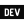

# Hi ! I'm Amir Hossein Kaveh 

[>)](https://git.io/typing-svg)

## Front-End Developer (React Developer)

As a Frontend Developer, I am passionate about creating high-quality web applications that provide a seamless user experience. I am proficient in modern front-end technologies. I am committed to delivering responsive and accessible designs that meet the needs of end-users. I am also well-versed in agile development methodologies and have experience collaborating with team members to achieve project goals.

- 🌍  I'm based in Shiraz ,Iran
- ✉️  You can contact me at [amirk1998.pv@gmail.com](mailto:amirk1998.pv@gmail.com)
- 🧠  I'm learning TypeScript
- 🤝  I'm open to collaborating on React Projects
   
   

# 💻 Tech Stack

## Languages

 
 

## Frameworks, Platforms & Libraries

 
 

## Hosting

 
 

## Other Tools

 
 

# 📫Socials

               
        
                
           
                   

 
 

# 📊 <b>My GitHub Stats</b>

